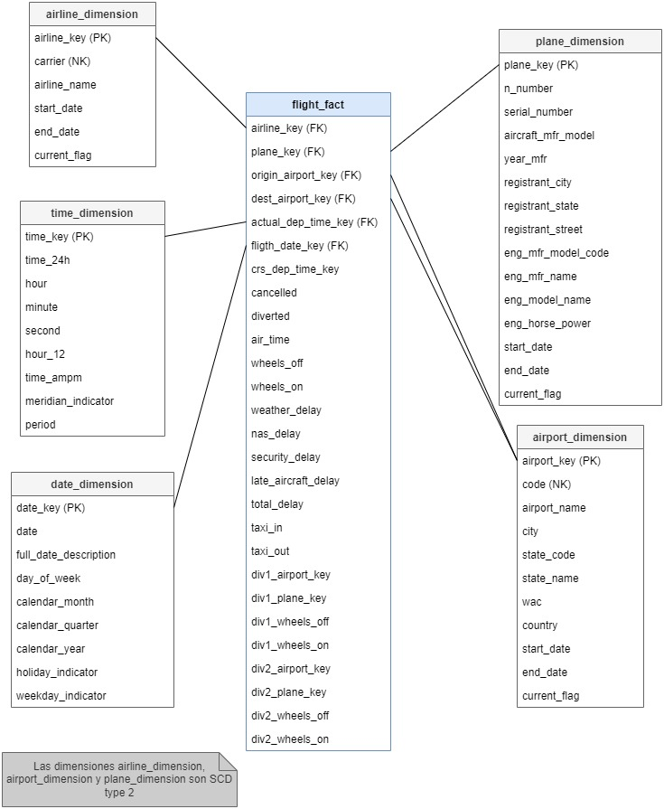
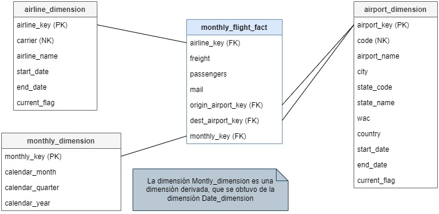
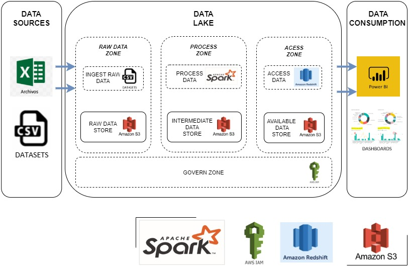

# MODELO MULTIDIMENSIONAL PARA EL PROCESO DE NEGOCIO DE VUELOS DE LAS COMPAÑÍAS ESTADOUNIDENSES
***

# TABLA DE CONTENIDO
- [INTRODUCCION A LA LOGICA DEL NEGOCIO](#introduccion-a-la-logica-del-negocio)
- [RESULTADOS DEL DATA PROFILING](#resultados-del-data-profiling)
- [MODELO DIMENSIONAL PROPUESTO](#modelo-dimensional-propuesto)
  - [Vuelos diarios](#vuelos-diarios)
  - [Pasajeros y cargamento del avión](#pasajeros-y-cargamento-del-avin)
- [ARQUITECTURA DEL DATA LAKE](#arquitectura-del-data-lake)
  - [Componentes de la arquitectura](#arquitectura-del-data-lake)
- [ENTREGABLES](#entregables)
  - [Scripts de spark utilizados para ETL](#scripts-de-spark-utilizados-para-etl)
  - [Scripts de creación de tablas en redshift](#scripts-de-creacin-de-tablas-en-redshift)
***
## INTRODUCCION A LA LOGICA DEL NEGOCIO

Hoy en día trasladarse de un lugar dentro o fuera del país es una necesidad que todas las personas
hacemos para cumplir con diligencias personales, laborales, de estudio entre otras. Siendo los medios
de transporte un factor esencial en la vida cotidiana. Tomando como referencia los viajes es evidente
que la manera más rápida de movilizarse rápidamente es por avión. Donde se observa que día a día
muchas personas alrededor del mundo utilizan este medio, ya sea que se desplace de un continente
a otro, de un país hacia otro país del mismo continente, e inclusive en países con gran extensión
territorial es posible viajar de un estado a otro; por lo tanto, es considerado como el medio de
transporte preferido por las personas por cuestiones relacionadas al tiempo, antes que cualquier otro
como, por ejemplo: el tren o metro, el barco, el autobús, entre otros. Razón por la cual diariamente y
de manera masiva se registran datos relacionados al viaje de un pasajero, resultando de gran
importancia analizar dichos datos de todo este entorno de vuelos y viajes.  
Como sabemos todo empieza con la compra de un boleto. Boleto que equivale en el transporte
colectivo al pago de $0.25 o $0.35 centavos de un autobús en nuestro país; un boleto ofrece diferentes
medios de pago de manera anticipada, caso opuesto del autobús que se cancela inmediatamente al
abordarlo. Las personas al comprar un boleto de avión pueden observar en este el número de vuelo
seleccionado, la hora y la fecha de salida programada y la información que abarca los datos generales
de la persona, como el registro del vuelo e información de la aerolínea, los cuales son recibidos en
gran número día con día en los aeropuertos del mundo.  
Tomando como referencia un vuelo, internamente está relacionado con información de gran
importancia la cual permite que todo se lleve a cabo de la manera más sistemática y ordenadamente
posible. El vuelo abarca el registro de aeropuerto, aerolínea, avión, fechas, horas, lugar de destino,
clima, etc., Debido a la gran cantidad de vuelos que se generan a diario suceden diferentes factores
que muchas veces se asocian con: retrasos y cancelaciones, las cuales por la gran cantidad de vuelos
que se presentan es difícil de analizar caso por caso para encontrar soluciones a estos problemas;
debido a estos hallazgos el proceso de negocio está enfocado en el análisis de los vuelos mediante un
enfoque de big data con el fin de poder responder a preguntas que se realizan frecuentemente por
los usuarios como las siguientes: ¿cuál es el mes del año en el que se presentan menos retrasos?, ¿cuál
es el motivo de cancelaciones de vuelos presentadas?, ¿adónde se realizan la mayor cantidad de
vuelos? etc., de manera que esta información presentada, sirva como un insumo fundamental para
crear y diseñar dashboards y reportes entendible e informativo para los usuarios finales que ofrezca
ayuda en la toma de decisiones; para ello se ha tomado como análisis un conjunto de dataset sobre
las compañías de vuelos estadounidenses, del cual se ha realizado de manera general el
planteamiento del problema mediante enfoque de sistemas que se detalla en los siguientes puntos.

***
## RESULTADOS DEL DATA PROFILING

Mediante Pandas Profiling se realizó un análisis detallado de cada dataset utilizado para crear el data
warehouse, el resultado de dicho análisis general se visualiza descargando los reportes en formato HTML generados 
y abriendo cada uno en un navegador web mayor detalle en la siguiente lista:

1. [Profiling Airlines](src/data_profiling/Airline.html)
2. [Profiling Airports](src/data_profiling/Airport.html)
3. [Profiling Flights](src/data_profiling/Fligth.html)
4. [Profiling Passangers](src/data_profiling/Passangers.html)
5. [Profiling Planes](src/data_profiling/Plane.html)
6. [Profiling WAC](src/data_profiling/WAC.html)

***
## MODELO DIMENSIONAL PROPUESTO
### Vuelos diarios

NECECIDADES DEL NEGOCIO

a. El negocio quiere entender el comportamiento de los vuelos en un periodo de tiempo. 
b. Los datos permiten el análisis de vuelos diariamente, contiene horarios de salida y llegada, programados y reales, motivo del retraso reportados por
las compañías aéreas estadounidenses.

**PASO 1: Seleccionar el proceso de negocio.**

*Vuelos diarios de aerolíneas de Estados Unidos en los años 2016 y 2017*

**PASO 2: Declaración de la granularidad de cada fact table**

Declaración de granularidad: vuelo por día.

**PASO 3: Identificación de las dimensiones.**

✓ Plane Dimension 

| plane_key | n_number | serial_number | aircraft_mfr_model | year_mfr | registrant_name | registrant_city | registrant_state | registrant_street | eng_mfr_model_code | eng_mfr_name | eng_model_name | eng_horse_power |
|-----------|----------|---------------|--------------------|----------|-----------------|-----------------|------------------|-------------------|--------------------|--------------|----------------|-----------------|
| 1         | 1AJ      | 156H          | 720282             | 1973     | JENKIS ARTHUR   | MEMPHIS         | TN               | PO BOX 129        | 0095               | ALLIANCE     | HESS WARRIOR   | 750             |

✓ Airport Dimension 

| airport_key | code  | airport_name                | city          | state_code | state_name | wac | country       |
|-------------|-------|-----------------------------|---------------|------------|------------|-----|---------------|
| 1           | 23421 | Atlantic City International | Atlantic City | NJ         | New Jersey | 21  | United States |

✓ Airline Dimension 

| airline_key | carrier | airline_name              |
|-------------|---------|---------------------------|
| 1           | AA      | American Airlines Inc: AA |

✓ Time Dimension 

| time_key | time_24h | hour | minute | second | hour_12 | time_ampm   | meridian_indicator | period   |
|----------|----------|------|--------|--------|---------|-------------|--------------------|----------|
| 1        | 00:00:01 | 0    | 0      | 1      | 12      | 12:00:01 am | AM                 | Midnight |

✓ Date Dimension 

| date_key | date       | full_date_description | date_of_week | calendar_month | calendar_quarter | calendar_year | holiday_indicator | weekday_indicator |
|----------|------------|-----------------------|--------------|----------------|------------------|---------------|-------------------|-------------------|
| 1        | 01/01/2016 | January 1, 2016       | Tuesday      | 1              | 1                | 2016          | Holiday           | 1                 |

**PASO 4: Identificación de las métricas**

✓ Cancelled: Indicador de vuelo cancelado (1 = Si)

✓ Diverted: Indicador de vuelo desviado (1 = Si)

✓ Air_time: Tiempo de vuelo (minutos)

✓ Wheels_off: Hace referencia a la hora de apagado de las ruedas del avión (hora local hhmm)

✓ Wheels_on: Hace referencia a la hora de encendido de las ruedas del avión (hora local hhmm)

✓ Weather_delay: Retraso meteorológico (minutos)

✓ Nas_delay: Retraso del sistema aéreo nacional (minutos)

✓ Security_delay: Retraso de seguridad (minutos)

✓ Late_aircraft_delay: Retraso tardío de la aeronave (minutos)

✓ Total_delay: Se calcula de la sumatoria de todos los delays

*FORMULA:* 𝑤𝑒𝑎𝑡ℎ𝑒𝑟𝑑𝑒𝑙𝑎𝑦 + 𝑛𝑎𝑠𝑑𝑒𝑙𝑎𝑦 + 𝑠𝑒𝑐𝑢𝑟𝑖𝑡𝑦𝑑𝑒𝑙𝑎𝑦 + 𝑙𝑎𝑡𝑒𝑎𝑖𝑟𝑐𝑟𝑎𝑓𝑡𝑑𝑒𝑙𝑎𝑦

✓ Taxi_in: Tiempo de movimiento a tiempo del avión mientras está en la pista (minutos)

✓ Taxi_out: Tiempo de salida de taxi (minutos)

✓ Div1_airport_key: Codigo de aeropuerto desviado 1

✓ Div1_plane_key: Codigo de avión desviado 1

✓ Div1_wheels_off: Tiempo en que las ruedas estan guardadas o apagadas (mientras el avion esta en el aire) con relación al desvio 1 

✓ Div1_wheels_on: Tiempo en que las ruedas estan guardadas o apagadas (mientras el avion esta tierra, aterrizando) con relación al desvio 1

✓ Div2_airport_key: Codigo de aeropuerto desviado 2

✓ Div2_plane_key: Codigo de avión desviado 2

✓ Div2_wheels_off: Tiempo en que las ruedas estan guardadas o apagadas (mientras el avion esta en el aire) con relación al desvio 2

✓ Div2_wheels_on: Tiempo en que las ruedas estan guardadas o apagadas (mientras el avion esta tierra, aterrizando) con relación al desvio 2

**MODELO DIMENSIONAL**
***

***

### Pasajeros y cargamento del avión

NECECIDADES DEL NEGOCIO

a. El negocio quiere entender el comportamiento de los vuelos según la cantidad de pasajeros y el cargamento que transporta el avión en un periodo
de tiempo. 
b. Los datos permiten el análisis de vuelos mensual, contiene horarios de salida y llegada, programados y reales de las compañías aéreas
estadounidenses.

**PASO 1: Seleccionar el proceso de negocio**

*Gestión de vuelos (pasajeros y cargamentos) de las aerolíneas y aeropuertos de Estados Unidos en los años 2016 y 2017*

**PASO 2: Declaración de la granularidad.**

Pasajeros y cargamento mensual de aerolíneas.

**PASO 3: Identificación de las dimensiones.**
Las siguientes dimensiones han sido reutilizadas del proceso de negocio Vuelos diarios de aerolíneas de Estados Unidos en los años 2016 y 2017.

✓ Airport Dimension

✓ Airline Dimension

Dimension del modelo

✓ Monthly_dimension

| monthly_key | calendar_month | calendar_quarter | calendar_year |
|-------------|----------------|------------------|---------------|
| 1           | 1              | 1                | 2016          |

**PASO 4: Identificación de las métricas**

✓ Freight: Carga (libras)

✓Passangers: Numero de pasajeros a bordo

✓ Mail: Correo de mercadeo en vuelo incluido (libras)

**MODELO DIMENSIONAL**
***

***
## ARQUITECTURA DEL DATA LAKE

***
### Componentes de la arquitectura

Los componentes mínimos que se necesitan para implementar un data lake son:

- **1. Data sources**
Son fuentes de datos muy parecidas a las de un DW que funcionan como inputs para el data
lake

- **2. Data Lake**
Está compuesto por las siguiente layers que pueden ser llamadas tambien Tiers o raw zone,
las cuales son las siguientes:

  - *2.1. Raw data zone:*
Aquí básicamente todos los datos son injestados en su formato natural y no
son alterados pueden ser a través de un formato en bash por medio de un proceso que se
ejecuta cada cierto tiempo, aquí se habilita a que los usuarios puedan acceder a los datos sin
ninguna transformación

  - *2.2. Process zone:* En esta zona se tienen datos a medio procesar (parcialmente procesados) es
donde están todos los pipelines (proceso que transforma datos) toman como input lo que
tiene el raw layer zone.

  - *2.3. Access zone:* Capa de presentación, aquí están los datos listos para poder ser consumidos por
x o y herramienta, por ejemplo, Tableu, Power Bi, algoritmos de machine learning etc.

  - *2.4. Govern Zone:* Contiene un conjunto de reglas y políticas de como administramos los datos
administrados en el data lake, esto nos ayuda a mantener los datos ordenados, esto se aplica
a todos los layers e incluye la administración de seguridad, accesos y permisos.

- **3. Data Comsuption**
En esta región se presentarán los datos a través de Dashboards y reportes que son de utilidad
en el proceso de toma de decisiones para los usuarios tácticos y estratégicos.

***
## ENTREGABLES
### Scripts de spark utilizados para ETL
La estructura implementada en Databricks se puede consultar descargando, importando en Databricks mediante el siguiente archivo:

[*Notebook Databricks*](idt115-project-databricks-notebooks.dbc)

### Scripts de creación de tablas en redshift
1. [Script airline_dimension](./src/scripts_redshift/airline_dimension.sql)
2. [Script airport_dimension](./src/scripts_redshift/airport_dimension.sql)
3. [Script date_dimension](./src/scripts_redshift/date_dimension.sql)
4. [Script monthly_dimension](./src/scripts_redshift/monthly_dimension.sql)
5. [Script plane_dimension](./src/scripts_redshift/plane_dimension.sql)
6. [Script time_dimension](./src/scripts_redshift/time_dimension.sql)
7. [Script flight_fact](./src/scripts_redshift/flight_fact.sql)
8. [Script monthly_flight_fact](./src/scripts_redshift/monthly_flight_fact.sql)
